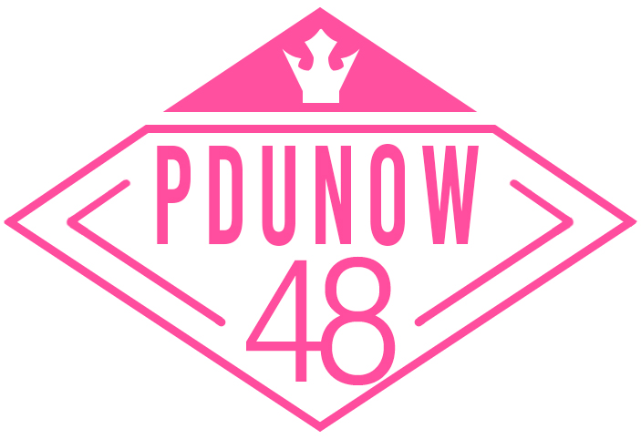

# PDUNOW 48



엠넷 프로듀스48 덕질  
프로듀스48 관련 현황 정보 수집 및 웹서비스 제공 프로젝트

Website : https://produce48.surge.sh

## External Resources

- Crawling : AWS EC2, AWS SNS, AWS Lambda
- Database : AWS DynamoDB
- API : AWS API Gateway, AWS Lambda
- Web publishing : surge

## Util

```bash
$ node ./util/createBaseMap.js // 빈 참조 맵파일 생성
$ node ./util/downloadMainPicture.js // 공식 홈페이지에서 연습생들의 메인 프로필 사진을 다운로드
$ node ./util/mappingGardenIdx.js // 국프의 정원 연습생별 코드를 공식 홈페이지의 연습생별 코드와 연결
```

## Crawling

```bash
$ node ./crawling/gardensHug.js // 국프의 정원 후원 현황을 수집, DynamoDB에 저장
$ node ./crawling/groupBattleDirectCam.js // 그룹 배틀 네캐 직캠 정보 수집, DynamoDB에 저장
$ node ./crawling/officialProfile.js // 공식 홈페이지에서 소녀들의 프로필 정보를 겟, DynamoDB에 저장
$ node ./crawling/positionDirectCam.js // 포지션 평가 네캐 직캠 정보 수집, DynamoDB에 저장
```

## Update DB

```bash
$ node ./dynamoDB/updateGardenStepDate.js // 국프의 정원 후원 단계 달성 날짜 정보를 업데이트
$ node ./dynamoDB/updateGardenStepVideo.js // 국프의 정원 후원 단계 달성 인증 영상 정보를 업데이트
$ node ./dynamoDB/updateGroupBattleDirectCamUrl.js // 그룹 배틀 직캠 영상 주소 업데이트
$ node ./dynamoDB/updateGroupBattleVote.js // 그룹 배틀 현장투표수 업데이트
$ node ./dynamoDB/updateLastRank.js // 연습생별 최근 순위 업데이트
$ node ./dynamoDB/updateNameInEnglish.js // 연습생 영어 이름 업데이트
$ node ./dynamoDB/updatePositionDirectCamUrl.js // 포지션 평가 직캠 영상 주소 업데이트
$ node ./dynamoDB/updatePositionVote.js // 포지션 평가 현장투표수 업데이트
$ node ./dynamoDB/updateRetired.js // 연습생 방출 정보 업데이트
```

## Running site locally

```bash
$ yarn install
$ yarn start
```

## Build site

```bash
$ yarn build
```

## Deploy site

```bash
$ yarn deploy
```
